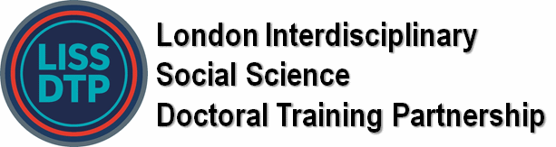

# Digital Methods for Analysing Texts

This course familiarises PhD students with the main **text mining** techniques in social science and develops
basic skills in digital methods. After completion you are familiar with the theoretical and methodological
underpinnings of natural language processing perspective and are able to conduct a basic text analysis.
Throughout the course we will focus on applying text analysis to empirical data, where possible related to
the students own research.

Students will become familiar with **digital methods in text analysis** as a flexible approach that comes with
a practical set of research instruments to empirically investigate a range of questions in social science. They
will learn how to approach and **manage text data, analyse texts, and visualize** this information.

## Course schedule

| Session date    | Session       | Lecture Topic                  | Seminar topic                     |
| :-------------  | :----------:  | -----------:                   | -----------:                      |
| 12 April        | 1             | Introduction to text mining    | Import text data                  |
| 14 April        | 2             | Analysing text                 | Methods for text preprocessing    |
| 19 April        | 3             | Analysing words                | Methods for word analysis         |
| 21 April        | 4             | Analysing relations            | Methods for co-ocurrence analysis |
| 26 April        | 5             | Topic modelling                | Methods for analysing context     |
| 28 April        | 6             | Text mining in the real world  | Analysing your own text           |

### Eligibility
You must be a PhD student at King’s, Queen Mary or Imperial, and you must have already registered as a
LISS DTP student via the following link: https://www.liss-dtp.ac.uk/registration/.

### Bibliography

📕 Bengfort, B., Bilbro, R., & Ojeda, T. (2018). *Applied text analysis with python: Enabling language-aware data products with machine learning.* O'Reilly Media, Inc.

🌍 https://course.spacy.io/en/chapter1

🌍 https://www.nltk.org/book/ch02.html

Course featured by:

